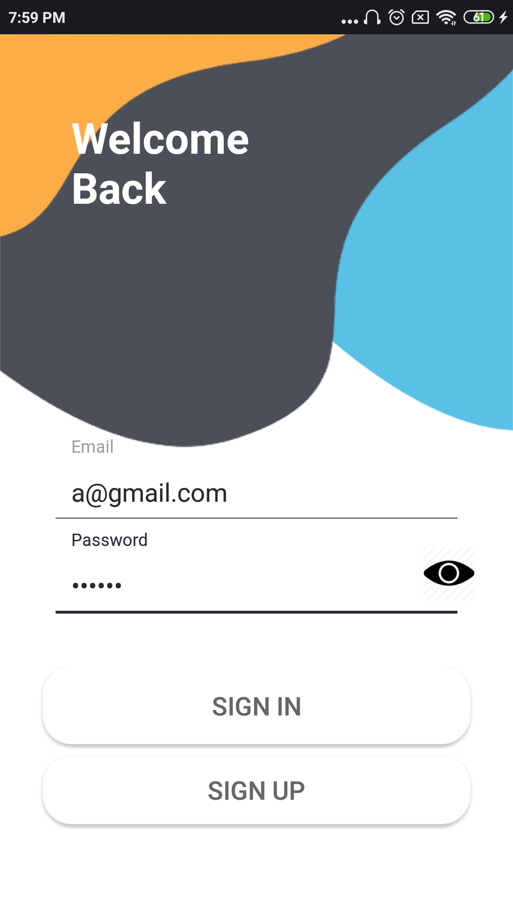
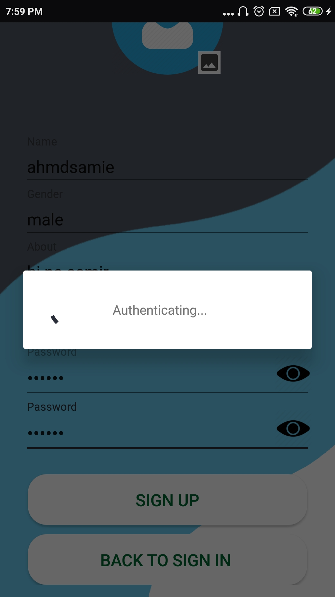
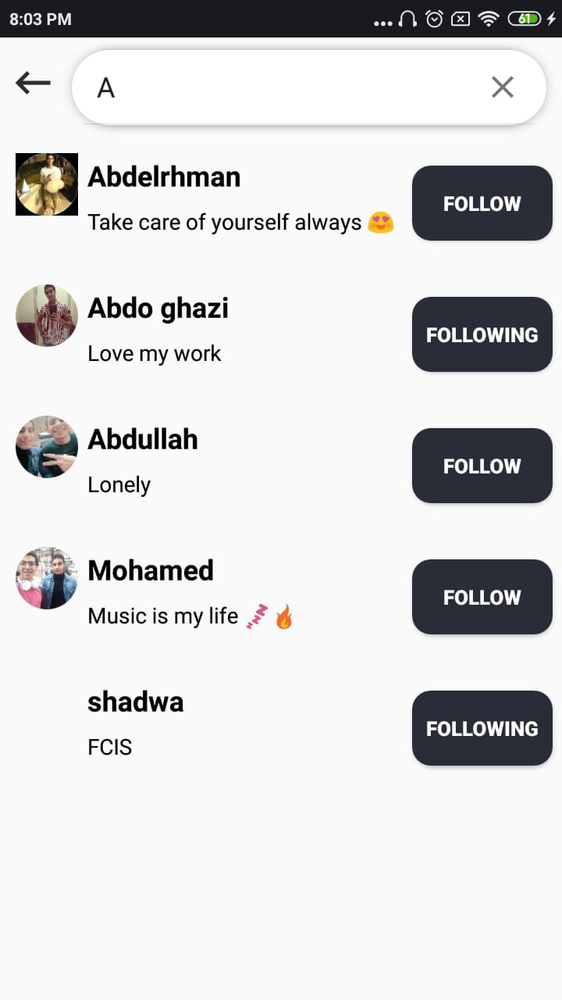
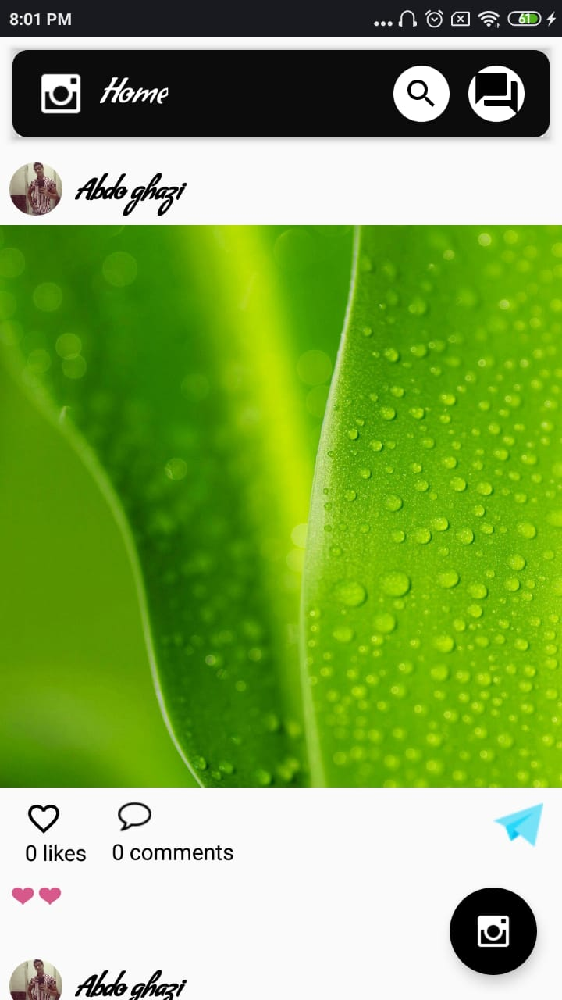

# insta-app
* this app is sample blog app
## this app is connected to [Chat app](https://github.com/ahmedsamir9/chat-app) 

## covered topics :
* shared preference
* material Design
* firestore
* MVC

## Screenshots:

